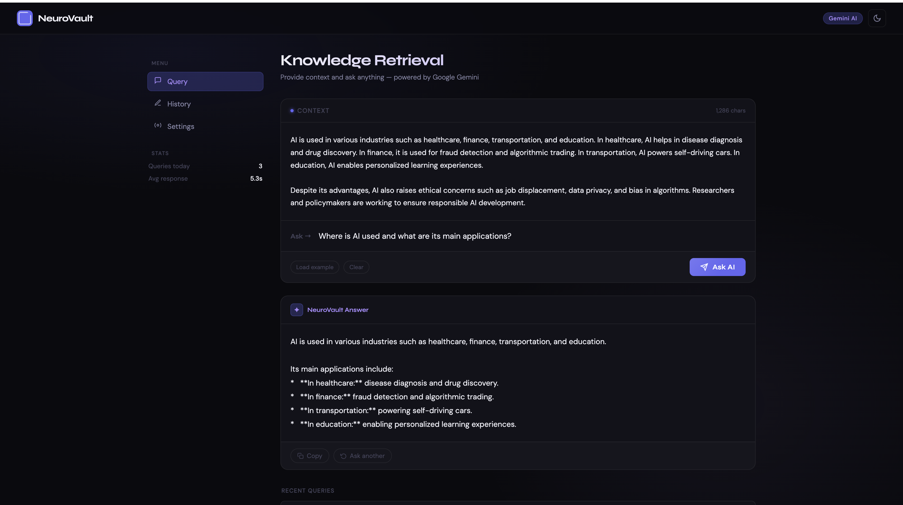
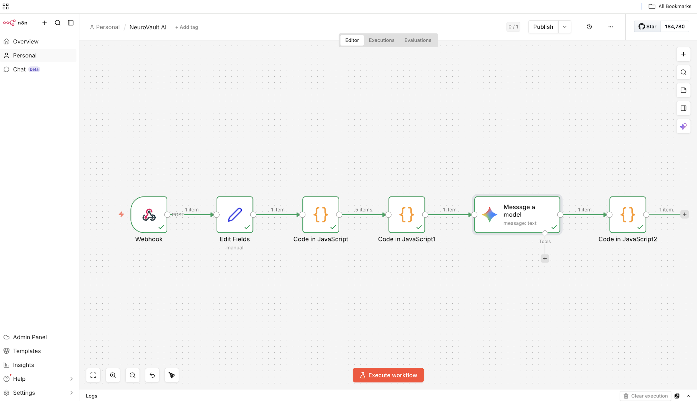
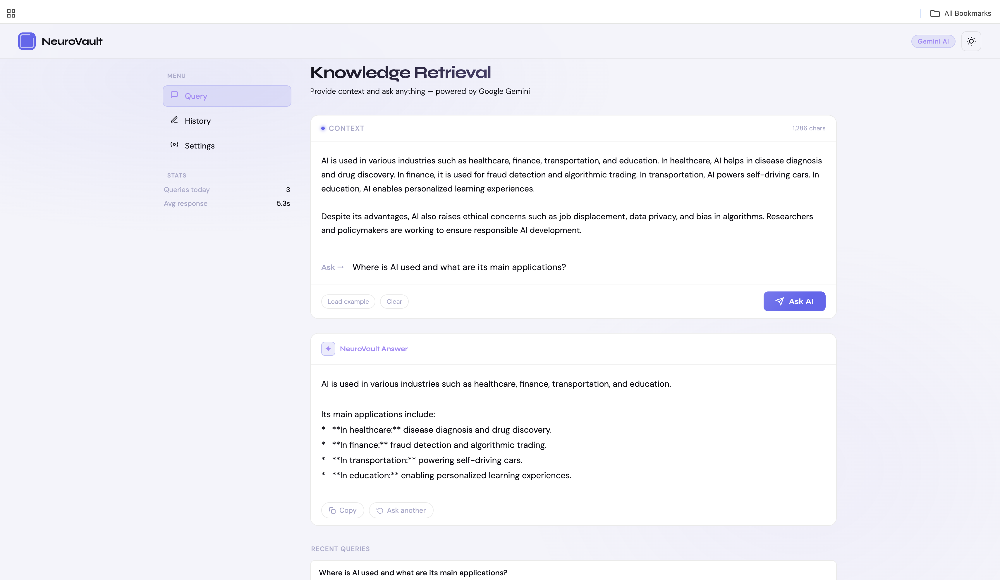

# 🧠 NeuroVault AI

An AI-powered **knowledge retrieval system** built using **n8n + Google Gemini API** that answers questions strictly based on provided context.

---

## 🚀 Overview

NeuroVault AI uses a **controlled RAG-style pipeline**:

* User provides context + question
* System processes and chunks data
* AI generates answers **ONLY from given context**
* Prevents hallucination

---

## ✨ Features

* 📚 Context-based Q&A
* ⚡ Fast AI responses
* 🔗 n8n automation workflow
* 🧩 Text chunking system
* 🎯 Controlled outputs
* 🌗 Dark / Light UI

---

## 📸 Screenshots

### 🧠 AI Response Demo



### ⚙️ n8n Workflow Pipeline



### 🌗 Light Mode UI



---

## ⚙️ How It Works

1. User inputs context + question
2. Text is split into chunks
3. n8n workflow processes data
4. Gemini model generates response
5. Output strictly uses provided context

---

## 🛠️ Tech Stack

* HTML, CSS, JavaScript
* n8n (workflow automation)
* Google Gemini API

---

## 📂 Project Structure

```
neurovault-ai/
│
├── NeuroVault.html
├── NeuroVault AI.json
├── screenshots/
│   ├── demo.png
│   ├── workflow.png
│   └── light.png
└── README.md
```

---

## 🔐 Security

API keys are not included.
Use your own Gemini API key.

---

## 🧪 Use Cases

* Document Q&A
* AI assistants
* Context-based chatbots
* Learning tools

---

## 📈 Future Improvements

* Backend integration
* Vector DB (Pinecone / FAISS)
* Authentication
* Deployment

---

## 👨‍💻 Author

**Tanmay Tyagi**

---

## ⭐ Support

Give a ⭐ if you liked the project!
